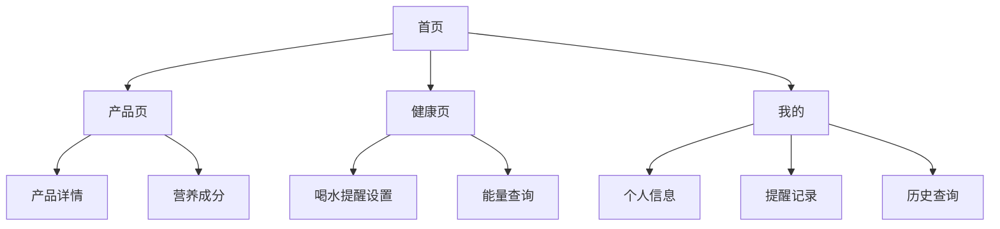

## 1. 产品概览
水厂小程序是一款集水厂信息展示、产品管理、健康提醒和营养查询于一体的移动应用。
- 主要目的是为用户提供水厂信息、产品详情，并帮助用户建立健康饮水习惯。
- 目标用户为关注健康饮水的普通消费者，市场价值在于提升用户饮水健康意识和便利性。

## 2. 核心功能

### 2.1 用户角色
| 角色 | 注册方式 | 核心权限 |
|------|---------------------|------------------|
| 普通用户 | 手机号注册 | 浏览水厂信息、查看产品、设置提醒、查询营养信息 |
| 管理员 | 后台登录 | 管理水厂信息、产品信息、用户数据 |

### 2.2 功能模块
1. **首页**：水厂介绍、产品展示、快速入口
2. **产品页**：产品详情、营养成分、购买链接
3. **健康页**：喝水提醒设置、能量查询工具
4. **我的**：个人信息、提醒记录、历史查询

### 2.3 页面详情
| 页面名称 | 模块名称 | 功能描述 |
|-----------|-------------|---------------------|
| 首页 | 水厂介绍 | 展示水厂基本信息、历史、荣誉等 |
| 首页 | 产品展示 | 轮播图展示热门产品，卡片式展示产品列表 |
| 首页 | 快速入口 | 快捷进入健康页、产品页等核心功能 |
| 产品页 | 产品详情 | 展示产品图片、名称、价格、描述等 |
| 产品页 | 营养成分 | 展示产品的营养成分表，包括能量、蛋白质、脂肪等 |
| 健康页 | 喝水提醒 | 设置提醒时间、频率、提醒方式等 |
| 健康页 | 能量查询 | 输入饮料名称，查询其能量含量 |
| 我的 | 个人信息 | 展示用户基本信息，支持修改 |
| 我的 | 提醒记录 | 展示历史提醒记录和完成情况 |
| 我的 | 历史查询 | 展示历史能量查询记录 |

## 3. 核心流程
用户打开小程序后，首先看到首页的水厂介绍和产品展示。用户可以浏览产品详情，查看营养成分。在健康页，用户可以设置喝水提醒，也可以查询各种饮料的能量。在个人中心，用户可以查看自己的提醒记录和历史查询。

## 4. 用户界面设计
### 4.1 设计风格
- 主色调：蓝色系 (#1E88E5)，代表水的纯净和健康
- 辅助色：浅绿色 (#4CAF50)，代表自然和活力
- 按钮风格：圆角按钮，有轻微的阴影效果
- 字体：无衬线字体，主标题 18px，副标题 16px，正文 14px
- 布局风格：卡片式布局，顶部导航栏，底部标签栏
- 图标风格：线性图标，简洁现代

### 4.2 页面设计概览
| 页面名称 | 模块名称 | UI元素 |
|-----------|-------------|-------------|
| 首页 | 水厂介绍 | 轮播图展示水厂环境，卡片式展示水厂信息，使用蓝色系配色，字体清晰易读 |
| 首页 | 产品展示 | 横向滚动的产品卡片，每张卡片包含产品图片、名称和价格，使用白色背景和蓝色边框 |
| 首页 | 快速入口 | 网格布局的功能图标，每个图标下方有文字说明，使用彩色图标增强视觉效果 |
| 产品页 | 产品详情 | 大图展示产品，下方是产品名称、价格和描述，使用卡片式布局，信息层次分明 |
| 产品页 | 营养成分 | 表格形式展示营养成分，使用绿色系配色突出健康概念，数据清晰易读 |
| 健康页 | 喝水提醒 | 时间选择器，频率设置滑块，提醒方式开关，使用蓝色系配色，界面简洁直观 |
| 健康页 | 能量查询 | 搜索输入框，查询按钮，结果展示区域，使用白色背景和蓝色强调色 |
| 我的 | 个人信息 | 头像、用户名、手机号等信息展示，支持点击修改，使用卡片式布局，界面干净整洁 |
| 我的 | 提醒记录 | 列表形式展示提醒记录，包含时间、状态等信息，使用灰色系配色，信息层次分明 |
| 我的 | 历史查询 | 列表形式展示历史查询记录，包含饮料名称、能量值等信息，使用白色背景和蓝色强调色 |

### 4.3 响应式设计
- 采用移动优先的响应式设计
- 针对不同屏幕尺寸（320px-768px）进行适配
- 支持触摸操作，按钮和可点击区域大小适合手指点击
- 在小屏幕上优化布局，确保内容清晰可读

### 4.4 3D场景指导（不适用）
- 本产品不包含3D场景