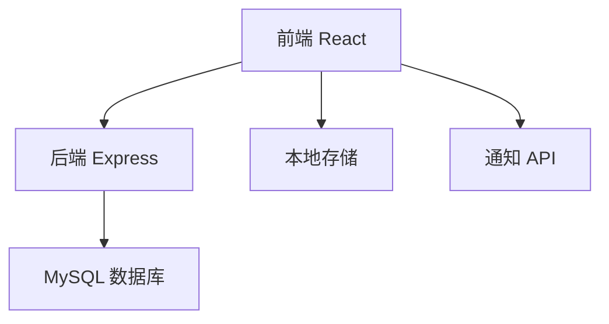
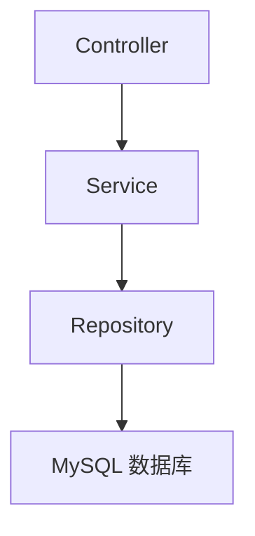
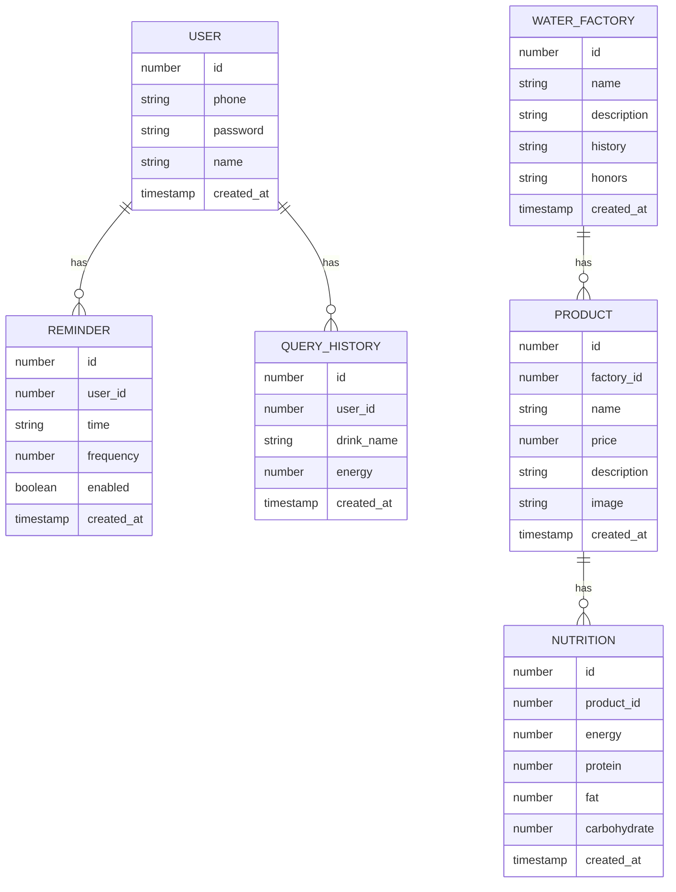

## 1. 架构设计


## 2. 技术描述
- 前端：React@18 + tailwindcss@3 + vite
- 初始化工具：vite-init
- 后端：Express@4
- 数据库：MySQL
- 状态管理：zustand
- 路由管理：react-router-dom
- UI组件：自定义组件 + lucide-react 图标库

## 3. 路由定义
| 路由 | 用途 |
|-------|---------|
| / | 首页，展示水厂信息和产品 |
| /products | 产品列表页 |
| /products/:id | 产品详情页 |
| /health | 健康页，包含喝水提醒和能量查询 |
| /profile | 个人中心页 |

## 4. API 定义
### 4.1 后端 API
| API 路径 | 方法 | 功能描述 | 请求体 | 响应体 |
|---------|------|----------|--------|--------|
| /api/water-factory | GET | 获取水厂信息 | N/A | `{id: number, name: string, description: string, history: string, honors: string[]}` |
| /api/products | GET | 获取产品列表 | N/A | `[{id: number, name: string, price: number, description: string, image: string, nutrition: object}]` |
| /api/products/:id | GET | 获取产品详情 | N/A | `{id: number, name: string, price: number, description: string, image: string, nutrition: object}` |
| /api/energy | GET | 查询饮料能量 | `{drinkName: string}` | `{name: string, energy: number, unit: string}` |
| /api/reminders | POST | 创建喝水提醒 | `{userId: number, time: string, frequency: number, enabled: boolean}` | `{id: number, userId: number, time: string, frequency: number, enabled: boolean}` |
| /api/reminders/:userId | GET | 获取用户提醒列表 | N/A | `[{id: number, time: string, frequency: number, enabled: boolean}]` |
| /api/reminders/:id | PUT | 更新提醒设置 | `{time: string, frequency: number, enabled: boolean}` | `{id: number, time: string, frequency: number, enabled: boolean}` |
| /api/reminders/:id | DELETE | 删除提醒 | N/A | `{success: boolean}` |
| /api/query-history | POST | 保存查询历史 | `{userId: number, drinkName: string, energy: number}` | `{id: number, userId: number, drinkName: string, energy: number, createdAt: string}` |
| /api/query-history/:userId | GET | 获取用户查询历史 | N/A | `[{id: number, drinkName: string, energy: number, createdAt: string}]` |
| /api/users | POST | 注册用户 | `{phone: string, password: string, name: string}` | `{id: number, phone: string, name: string}` |
| /api/users/login | POST | 用户登录 | `{phone: string, password: string}` | `{token: string, user: {id: number, phone: string, name: string}}` |

## 5. 服务器架构图


## 6. 数据模型
### 6.1 数据模型定义


### 6.2 数据定义语言
```sql
-- 创建用户表
CREATE TABLE IF NOT EXISTS users (
    id INT PRIMARY KEY AUTO_INCREMENT,
    phone VARCHAR(20) UNIQUE NOT NULL,
    password VARCHAR(255) NOT NULL,
    name VARCHAR(50) NOT NULL,
    created_at TIMESTAMP DEFAULT CURRENT_TIMESTAMP
);

-- 创建提醒表
CREATE TABLE IF NOT EXISTS reminders (
    id INT PRIMARY KEY AUTO_INCREMENT,
    user_id INT NOT NULL,
    time VARCHAR(10) NOT NULL,
    frequency INT NOT NULL,
    enabled BOOLEAN DEFAULT true,
    created_at TIMESTAMP DEFAULT CURRENT_TIMESTAMP,
    FOREIGN KEY (user_id) REFERENCES users(id) ON DELETE CASCADE
);

-- 创建查询历史表
CREATE TABLE IF NOT EXISTS query_history (
    id INT PRIMARY KEY AUTO_INCREMENT,
    user_id INT NOT NULL,
    drink_name VARCHAR(100) NOT NULL,
    energy FLOAT NOT NULL,
    created_at TIMESTAMP DEFAULT CURRENT_TIMESTAMP,
    FOREIGN KEY (user_id) REFERENCES users(id) ON DELETE CASCADE
);

-- 创建水厂表
CREATE TABLE IF NOT EXISTS water_factory (
    id INT PRIMARY KEY AUTO_INCREMENT,
    name VARCHAR(100) NOT NULL,
    description TEXT NOT NULL,
    history TEXT NOT NULL,
    honors TEXT NOT NULL,
    created_at TIMESTAMP DEFAULT CURRENT_TIMESTAMP
);

-- 创建产品表
CREATE TABLE IF NOT EXISTS products (
    id INT PRIMARY KEY AUTO_INCREMENT,
    factory_id INT NOT NULL,
    name VARCHAR(100) NOT NULL,
    price DECIMAL(10,2) NOT NULL,
    description TEXT NOT NULL,
    image VARCHAR(255) NOT NULL,
    created_at TIMESTAMP DEFAULT CURRENT_TIMESTAMP,
    FOREIGN KEY (factory_id) REFERENCES water_factory(id) ON DELETE CASCADE
);

-- 创建营养成分表
CREATE TABLE IF NOT EXISTS nutrition (
    id INT PRIMARY KEY AUTO_INCREMENT,
    product_id INT NOT NULL,
    energy FLOAT NOT NULL,
    protein FLOAT NOT NULL,
    fat FLOAT NOT NULL,
    carbohydrate FLOAT NOT NULL,
    created_at TIMESTAMP DEFAULT CURRENT_TIMESTAMP,
    FOREIGN KEY (product_id) REFERENCES products(id) ON DELETE CASCADE
);

-- 插入初始数据
INSERT INTO water_factory (name, description, history, honors) VALUES (
    '清泉水厂',
    '清泉水厂成立于1998年，位于风景秀丽的山区，采用天然山泉水，经过多重过滤和消毒处理，为消费者提供优质的饮用水。',
    '1998年建厂，2000年通过ISO9001质量认证，2005年获得国家免检产品称号，2010年扩建生产线，2015年推出高端矿泉水系列。',
    '国家免检产品、中国驰名商标、消费者信得过产品、绿色食品认证'
);

INSERT INTO products (factory_id, name, price, description, image) VALUES
(1, '清泉矿泉水', 2.5, '天然山泉水，富含多种矿物质，口感清冽甘甜', 'https://trae-api-cn.mchost.guru/api/ide/v1/text_to_image?prompt=mineral%20water%20bottle%20blue%20label&image_size=square'),
(1, '清泉纯净水', 1.5, '经过多重过滤的纯净水，适合日常饮用', 'https://trae-api-cn.mchost.guru/api/ide/v1/text_to_image?prompt=pure%20water%20bottle%20transparent&image_size=square'),
(1, '清泉碱性水', 3.5, 'pH值7.5-8.5的碱性水，有助于调节体内酸碱平衡', 'https://trae-api-cn.mchost.guru/api/ide/v1/text_to_image?prompt=alkaline%20water%20bottle%20green%20label&image_size=square'),
(1, '清泉矿物质水', 2.0, '添加了人体所需的多种矿物质，营养更均衡', 'https://trae-api-cn.mchost.guru/api/ide/v1/text_to_image?prompt=mineral%20enhanced%20water%20bottle&image_size=square');

INSERT INTO nutrition (product_id, energy, protein, fat, carbohydrate) VALUES
(1, 0, 0, 0, 0),
(2, 0, 0, 0, 0),
(3, 0, 0, 0, 0),
(4, 0, 0, 0, 0);

-- 插入测试用户
INSERT INTO users (phone, password, name) VALUES
('13800138000', '123456', '测试用户');
```